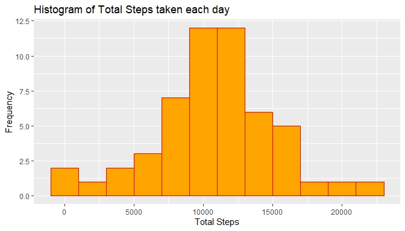
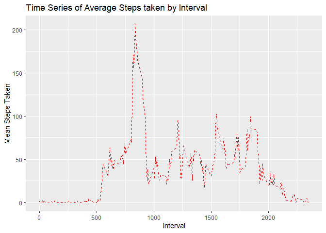
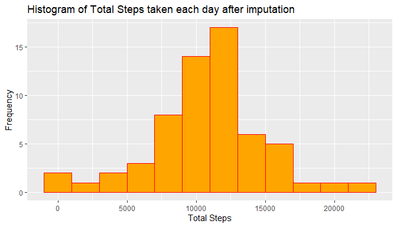
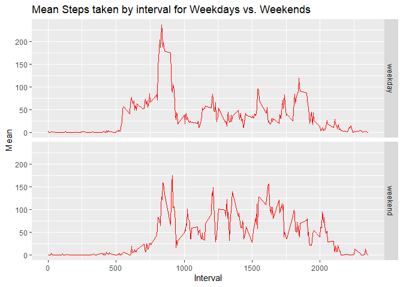

## Loading and preprocessing the data

Let us begin with loading the necessary libraries and our data set. We will also do a bit of preliminary
cleaning on the data set by converting the date variable into a valid date format.

```r
require("tidyverse")
```


```r
AMD = read.csv("activity.csv")
AMD$date = as.Date(as.character(AMD$date))
```

## What is mean total number of steps taken per day?

The first part of the assignment asks us to create a histogram of the number of steps taken each day. The 
activity data frame contains columns for steps, date, and interval. To answer this question, we have to
group the data by date, then sum the number of steps across all the different days.


```r
tsteps = AMD %>% group_by(date) %>% summarize(Total_Steps = sum(steps))
g = ggplot(tsteps, aes(Total_Steps))
g + geom_histogram(color = "red", binwidth = 2000, fill = "orange") +
  xlab("Total Steps") +
  ylab("Frequency") +
  ggtitle("Histogram of Total Steps taken each day")
```

<!-- -->

After the data has been grouped properly, we can use the Total_Steps variable created in the tsteps summary
to calculate the mean and median number of steps taken each day.


```r
mean_median_steps = tsteps %>% summarize(Mean_Steps = mean(Total_Steps, na.rm =T),
                                         Median_Steps = median(Total_Steps, na.rm=T))
m = trunc(mean_median_steps$Mean_Steps)
med = mean_median_steps$Median_Steps
```

The mean number of steps taken each day is 10766 and the median number of steps is 10765.

## What is the average daily activity pattern?

Next we are asked to create a time series plot capturing the average number of steps taken by interval. Each
day is split into 5 minute intervals, so we know that if we group by interval, taking the mean will give us
what we are looking for. 


```r
mean_by_interval = AMD %>% group_by(interval) %>% summarize(Mean = mean(steps, na.rm = T))
g2 = ggplot(mean_by_interval, aes(interval, Mean))
g2 + geom_line(linetype = "dashed", color = "red") +
     xlab("Interval") +
     ylab("Mean Steps Taken") +
     ggtitle("Time Series of Average Steps taken by Interval")
```

<!-- -->

Does our plot make sense? It looks like it, since between midnight and roughly 5 A.M., there is little activity,
indictating that people are sleeping. Then activity peaks during the middle of the day and is consistent throughout, before slowly declining as night arrives. 

How about the 5 minute interval where on average, the most number of steps are taken?

```r
which(mean_by_interval$Mean == (max(mean_by_interval$Mean, na.rm=T)))
```

```
## [1] 104
```

```r
MI = mean_by_interval[104,]
max_steps = round(MI$Mean, digits = 2)
max_interval = MI$interval
```
The interval that contains the max number of steps on average (206.17) is interval 835.

## Imputing missing values

The data frame contains many missing values that need to be imputed through some logical method. Let's first
take a look at how many NA values there are and where they are located.

```r
mv = sum(is.na(AMD))
```
The number of missing values in the dataset is 2304.


```r
missing_data = AMD %>% group_by(date) %>% summarize(missing = sum(is.na(steps)))
head(missing_data)
```

```
## # A tibble: 6 x 2
##   date       missing
##   <date>       <int>
## 1 2012-10-01     288
## 2 2012-10-02       0
## 3 2012-10-03       0
## 4 2012-10-04       0
## 5 2012-10-05       0
## 6 2012-10-06       0
```
So there are 2304 NA values, but what is more interesting is that days with missing values are missing every
single value for that day, and all other days have complete observations across every interval. One interesting
imputation method I considered is finding the specific day of the week (i.e. Tuesday) for days with missing 
values, and filling in missing values with the average number of steps for that day of the week. 

First we need to calculate the mean number of steps taken for each interval on a given weekday. Then, we will
pinpoint exactly which dates have missing values, and on what day of the week they fall on.


```r
AMD$day = weekdays(AMD$date)
AMD$day = as.factor(AMD$day)

mean_by_weekday = AMD %>% group_by(day, interval) %>% summarize(mean = mean(steps,na.rm=T))

missing_data$day = weekdays(missing_data$date)
missing_data$day = as.factor(missing_data$day)
missing_days = subset(missing_data, missing == 288)
missing_days
```

```
## # A tibble: 8 x 3
##   date       missing day      
##   <date>       <int> <fct>    
## 1 2012-10-01     288 Monday   
## 2 2012-10-08     288 Monday   
## 3 2012-11-01     288 Thursday 
## 4 2012-11-04     288 Sunday   
## 5 2012-11-09     288 Friday   
## 6 2012-11-10     288 Saturday 
## 7 2012-11-14     288 Wednesday
## 8 2012-11-30     288 Friday
```

The missing_days data frame tells us exactly where to impute our values, and now we just need the values
that we will use to do so. I created vectors containing the mean steps taken for each interval on the days
we need, which is all days except Tuesday, as Tuesdays contained no missing values. 


```r
monday_values = subset(mean_by_weekday, day == "Monday")
mm = c(monday_values$mean)
head(monday_values)
```

```
## # A tibble: 6 x 3
## # Groups:   day [1]
##   day    interval  mean
##   <fct>     <int> <dbl>
## 1 Monday        0  1.43
## 2 Monday        5  0   
## 3 Monday       10  0   
## 4 Monday       15  0   
## 5 Monday       20  0   
## 6 Monday       25  5
```

```r
head(mm)
```

```
## [1] 1.428571 0.000000 0.000000 0.000000 0.000000 5.000000
```

```r
wednesday_values = subset(mean_by_weekday, day == "Wednesday")
wm = c(wednesday_values$mean)
thursday_values = subset(mean_by_weekday, day == "Thursday")
tm = c(thursday_values$mean)
friday_values = subset(mean_by_weekday, day == "Friday")
fm = c(friday_values$mean)
saturday_values = subset(mean_by_weekday, day == "Saturday")
satm = c(saturday_values$mean)
sunday_values = subset(mean_by_weekday, day == "Sunday")
sunm = c(sunday_values$mean)
```

Finally, with the knowledge of where to impute and what to impute, let's impute the values.

```r
AMD_imputed = AMD

AMD_imputed$steps[AMD$date == "2012-10-01"] = mm
AMD_imputed$steps[AMD$date == "2012-10-08"] = mm
AMD_imputed$steps[AMD$date == "2012-11-01"] = tm
AMD_imputed$steps[AMD$date == "2012-11-04"] = sunm
AMD_imputed$steps[AMD$date == "2012-11-09"] = fm
AMD_imputed$steps[AMD$date == "2012-11-10"] = satm
AMD_imputed$steps[AMD$date == "2012-11-14"] = wm
AMD_imputed$steps[AMD$date == "2012-11-30"] = fm
```

Last but not least, reconstructing the histogram of total steps taken each day, but now with imputed values.

```r
tsteps_imputed = AMD_imputed %>% 
  group_by(date) %>% 
  summarize(Total_Steps = sum(steps)) %>%
  mutate(Mean_Steps = mean(Total_Steps),
         Median_Steps = median(Total_Steps))

g3 = ggplot(tsteps_imputed, aes(Total_Steps))
g3 + geom_histogram(color = "red", binwidth = 2000, fill = "orange") +
  xlab("Total Steps") +
  ylab("Frequency") +
  ggtitle("Histogram of Total Steps taken each day after imputation")
```

<!-- -->

How has imputing with this method affected the mean and median? 

```r
head(tsteps_imputed, 1)
```

```
## # A tibble: 1 x 4
##   date       Total_Steps Mean_Steps Median_Steps
##   <date>           <dbl>      <dbl>        <dbl>
## 1 2012-10-01       9975.     10821.        11015
```
So the new mean is ~10821, and the new median is 11015, both an increase from the previous mean and median
before imputation. This is completely possible because my method of imputation was not uniform across all
missing values. There were days of the week that had more missing values than other days, such as Monday and
Friday, so the mean will be more skewed towards the mean of those two days as opposed to other days. This
phenomenon also accounts for the shift in the median. 

## Are there differences in activity patterns between weekdays and weekends?

Since we already created the day variable for the previous section, we just need to revalue the factors
so that there are only two levels: weekday and weekend.


```r
AMD_imputed$day = plyr::revalue(AMD_imputed$day, c("Monday" = "weekday", "Tuesday" = "weekday",
                                                   "Wednesday" = "weekday", "Thursday" = "weekday",
                                                   "Friday" = "weekday", "Saturday" = "weekend",
                                                   "Sunday" = "weekend"))
```

Time to construct the panel plot. We create a new data frame called mean_by_day_interval, grouping by
day and interval, then computing the mean for each interval. What we find is that there are indeed
some differences in activity patterns between weekdays and weekends.


```r
mean_by_day_interval = AMD_imputed %>% group_by(day, interval) %>% summarize(Mean = mean(steps))

g4 = ggplot(mean_by_day_interval, aes(interval, Mean))
g4 + geom_line(linetype = "solid", color = "red") +
     facet_grid(day ~.) +
     xlab("Interval") +
     ggtitle("Mean Steps taken by interval for Weekdays vs. Weekends")
```

<!-- -->

